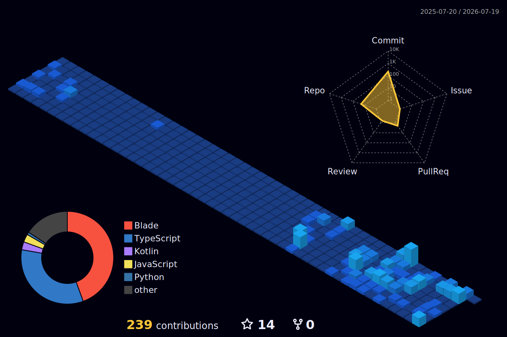

# Deyafa Arsetya

  

  
  
  

---

Halo! Saya **Deyafa Arsetya** (Yafa)

---

### Publikasi Ilmiah

Karya tulis ilmiah saya yang berfokus pada digitalisasi layanan publik:
- 📑 **Judul**: *Sistem Informasi Modul Registrasi NPWPD Berbasis Laravel pada BPPKAD Kota Kediri*.
- 🔑 **Keywords**: Framework Laravel, NPWPD, Public Service, System, Transparency.
- 🔗 **DOI**: [https://doi.org/10.62951/router.v3i4.821](https://doi.org/10.62951/router.v3i4.821)

### Jejak Akademik & Referensi

  
  
  

---

### Tech Stack

  <!-- Languages -->
  
  
  
  
  
   
  <!-- Frameworks & Libs -->
  
  
  
  
   
  <!-- Databases & BaaS -->
  
  
  
   
  <!-- Tools -->
  
  
  

---

### GitHub Stats & Aktivitas

   
   
  

---

<h2 align="center">Data City Contribution Graph</h2>

  

---

### Grafik Produktivitas Terkini

  

---

  <em>Profil ini dikelola secara berkala oleh Deyafa Arsetya.</em>

