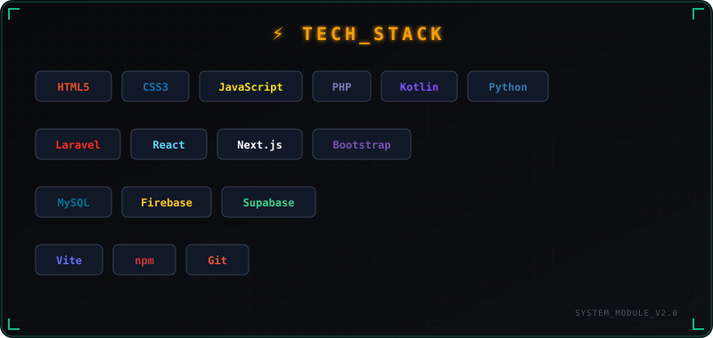
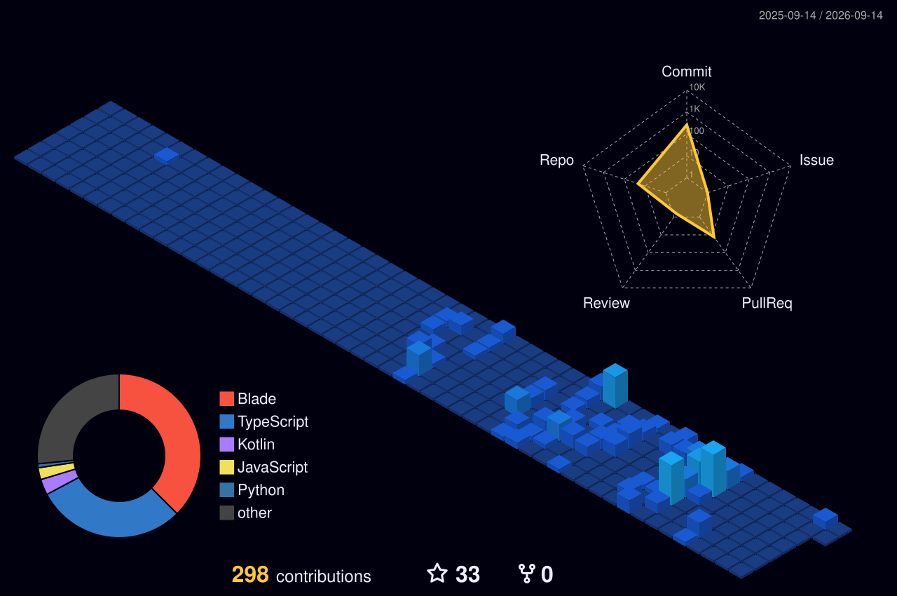

  <!-- Banner Header SVG -->
  

 

  <!-- Lencana Sosial Media & Kontak -->
  
  
  
  

 

  <!-- Tech Stack SVG Card -->
  

 

<!-- Layout Berdampingan: Foto di Kiri & Animasi di Kanan -->

  <table border="0" align="center" style="border: none;">
    <tr>
      <td align="center" style="padding: 10px; border: none;">
        
      </td>
      <td align="center" style="padding: 10px; border: none;">
        
      </td>
    </tr>
  </table>

 

<!-- Pac-Man Contribution Graph -->

  <picture>
    <source media="(prefers-color-scheme: dark)" srcset="https://raw.githubusercontent.com/GuilhermeNobrega/GuilhermeNobrega/output/pacman-contribution-graph-dark.svg">
    <source media="(prefers-color-scheme: light)" srcset="https://raw.githubusercontent.com/GuilhermeNobrega/GuilhermeNobrega/output/pacman-contribution-graph.svg">
    
  </picture>

---

### Publikasi Ilmiah

> **Sistem Informasi Modul Registrasi NPWPD Berbasis Laravel pada BPPKAD Kota Kediri**
> 
> Karya tulis ilmiah yang berfokus pada digitalisasi dan transparansi layanan publik.
> * 🔑 **Keywords**: *Framework Laravel, NPWPD, Public Service, System, Transparency*
> * 🔗 **DOI**: [https://doi.org/10.62951/router.v3i4.821](https://doi.org/10.62951/router.v3i4.821)

### Jejak Akademik & Referensi

  
  
  

---

### GitHub Stats & Aktivitas

   
   
  

<h3 align="center">Data City Contribution Graph</h3>

  

 

  <!-- Lets Code Animation -->
  

---

  <em>Dikelola oleh Deyafa Arsetya.</em>

